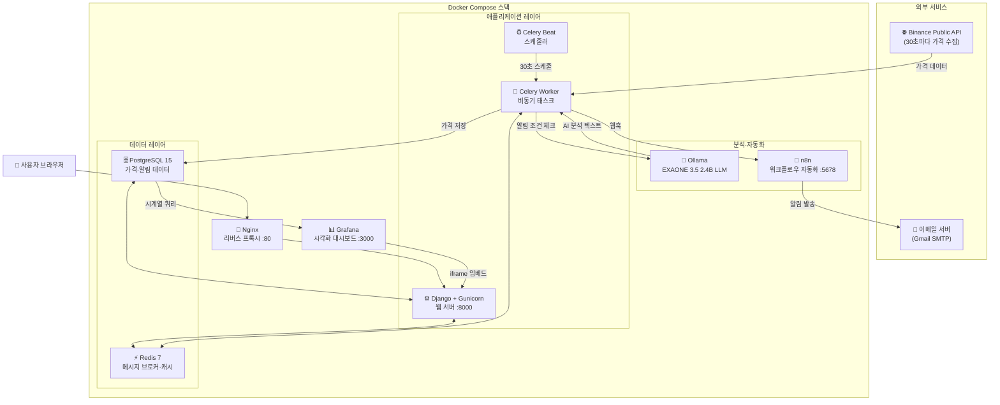
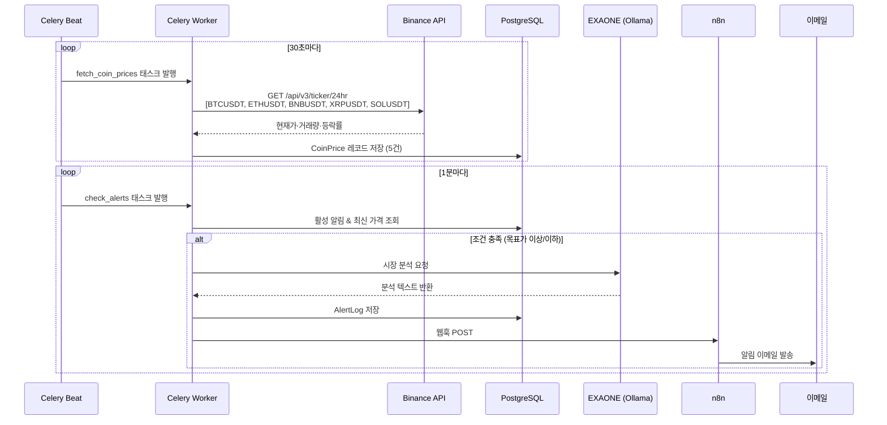
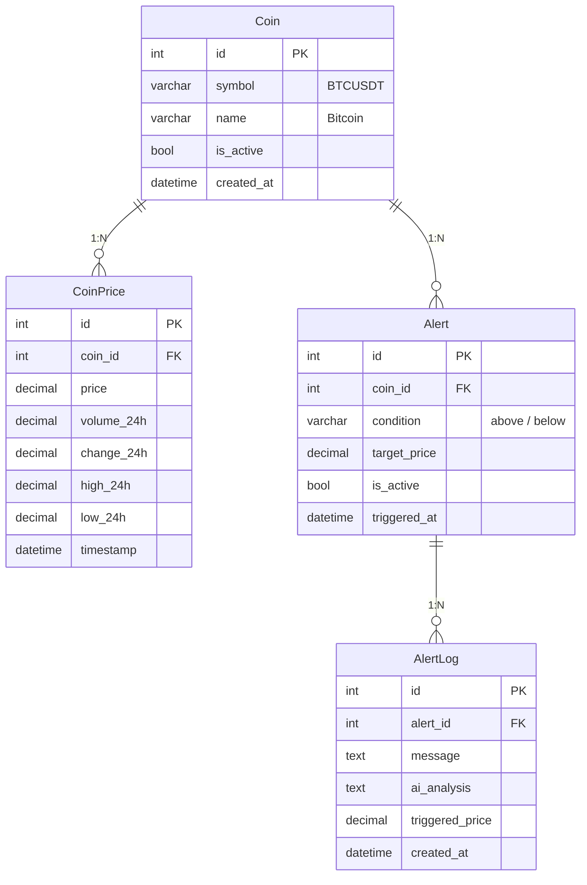
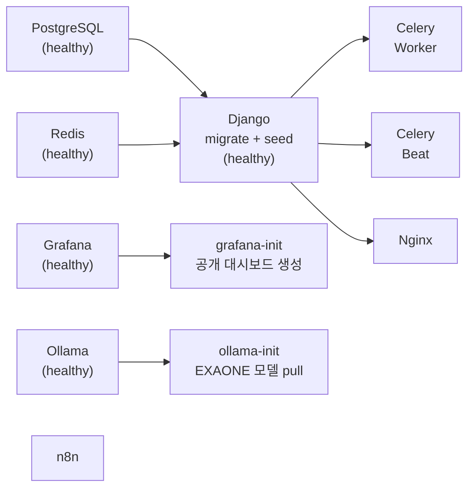

# Crypto Monitor

실시간 암호화폐 가격 모니터링 및 AI 분석 알림 플랫폼

Binance 공개 API로 5개 코인(BTC, ETH, BNB, XRP, SOL)의 가격을 30초마다 자동 수집하고, 사용자 정의 조건 충족 시 EXAONE AI 분석과 함께 알림을 발송합니다.

---

## 시스템 아키텍처



---

## 데이터 수집 및 알림 흐름



---

## 핵심 기능

### 실시간 가격 모니터링
- **수집 주기**: 30초
- **대상 코인**: BTC, ETH, BNB, XRP, SOL (Binance USDT 페어)
- **수집 항목**: 현재가·24시간 거래량·등락률·최고/최저가
- **데이터 보관**: 최근 48시간 (자동 정리)

### AI 알림 시스템
- **알림 조건**: 코인별 목표가 이상/이하 설정
- **AI 분석**: 조건 충족 시 EXAONE 3.5 2.4B가 시장 상황 분석
- **알림 전달**: n8n 워크플로우 → Gmail 이메일 발송

### 시각화 대시보드
- **실시간 카드**: 30초 자동 갱신, 가격 상승/하락 애니메이션
- **Grafana 임베드**: iframe으로 상세 시계열 차트 통합
- **시장 요약**: 상승·하락 코인 수, 평균 변동률

---

## 데이터베이스 구조



---

## 기술 스택

| 구분 | 기술 |
|------|------|
| **백엔드** | Django 4.2, Django REST Framework, Gunicorn |
| **비동기** | Celery 5.3, Celery Beat |
| **데이터베이스** | PostgreSQL 15 |
| **캐시·브로커** | Redis 7 |
| **AI** | Ollama + EXAONE 3.5 2.4B |
| **자동화** | n8n |
| **시각화** | Grafana 10.2 |
| **프록시** | Nginx |
| **컨테이너** | Docker Compose |

---

## 서비스 실행 순서



---

## 빠른 시작

### 1. 환경 변수 설정
```bash
cp .env.example .env
# .env 파일을 열어 비밀번호와 이메일 설정 입력
```

### 2. 실행
```bash
docker compose up -d
```

### 3. 접속

| 서비스 | URL |
|--------|-----|
| 메인 대시보드 | http://localhost |
| Grafana | http://localhost:3000 |
| n8n | http://localhost:5678 |
| Django Admin | http://localhost/admin |

> 첫 실행 시 Django migrate, 코인 데이터 seed, EXAONE 모델 다운로드가 자동으로 진행됩니다 (5~10분 소요).

---

## 환경 변수 (.env)

```env
# Django
SECRET_KEY=your-django-secret-key
DEBUG=False

# PostgreSQL
POSTGRES_DB=crypto_monitor
POSTGRES_USER=your-db-user
POSTGRES_PASSWORD=your-db-password

# Grafana
GRAFANA_ADMIN_USER=admin
GRAFANA_ADMIN_PASSWORD=your-grafana-password

# n8n
N8N_BASIC_AUTH_USER=admin
N8N_BASIC_AUTH_PASSWORD=your-n8n-password

# 이메일 알림 (Gmail)
EMAIL_HOST_USER=your-email@gmail.com
EMAIL_HOST_PASSWORD=your-app-password

# n8n 웹훅 URL (n8n에서 생성 후 입력)
N8N_WEBHOOK_URL=http://n8n:5678/webhook/your-webhook-id
```
